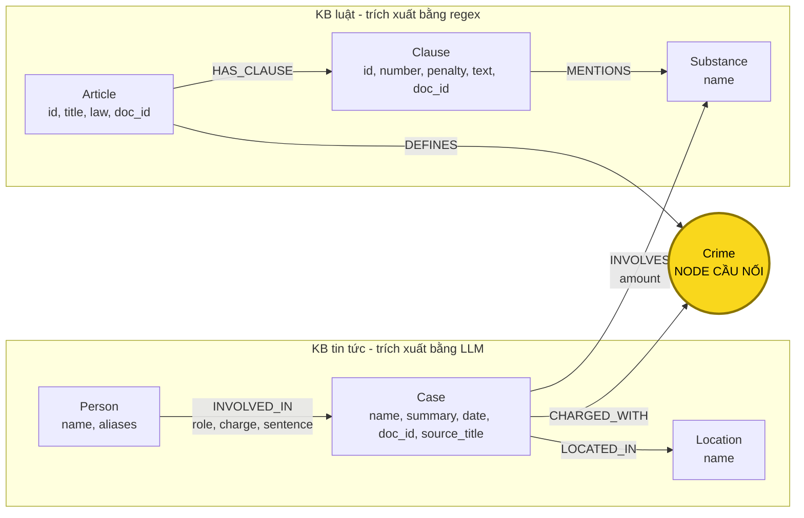

# Thiết kế Ontology — Day 19

**Họ tên:** Nguyễn Văn Việt  **MSSV:** 2A202602904

**Lựa chọn** (đánh dấu một):

- [X] Dùng ontology gợi ý (có thể chỉnh nhỏ)
- [ ] Tự thiết kế (xét bonus +15, xem `SUBMISSION.md`)

Ontology này giữ nguyên các label và relationship của phương án gợi ý trong `src/graph.py`. Phần truy xuất sẽ ưu tiên tội danh gắn với từng người, nhận biết câu hỏi về mức phạt cao nhất và dùng `Substance` để hỗ trợ truy vấn theo chất ma túy. Đây là điều chỉnh ở logic truy vấn, không thay đổi schema.

## 1. Sơ đồ

`Crime` là cầu nối chính giữa hai KB. `Substance` là đường nối phụ giúp tìm khoản luật theo chất và tổng hợp các vụ cùng liên quan đến một chất.

## 2. Entity types (node labels)

| Label         | Ý nghĩa                                                                 | Khóa định danh (`MERGE` theo)           | Properties                                                    | Lấy từ KB nào                                            | Trích bằng (regex / LLM / khác)                               |
| ------------- | ------------------------------------------------------------------------- | -------------------------------------------- | ------------------------------------------------------------- | ----------------------------------------------------------- | ---------------------------------------------------------------- |
| `Article`   | Một điều luật                                                         | `id`, ví dụ `Điều 251 BLHS`          | `id`, `title`, `law`, `doc_id`                        | Luật                                                       | Metadata và regex                                               |
| `Clause`    | Một khoản trong điều luật                                            | `id`, ví dụ `Điều 251 BLHS khoản 1` | `id`, `number`, `penalty`, `text`, `doc_id`         | Luật                                                       | Regex                                                            |
| `Crime`     | Tội danh chuẩn được điều luật định nghĩa và vụ án đề cập | `name` đã chuẩn hóa                    | `name`                                                      | Luật; tin tức được liên kết về danh sách từ luật | Regex từ tiêu đề luật, LLM cho tin, sau đó`link_entity` |
| `Case`      | Một vụ việc/vụ án được mô tả trong bài báo                    | `name`                                     | `name`, `summary`, `date`, `doc_id`, `source_title` | Tin tức                                                    | LLM JSON                                                         |
| `Person`    | Người liên quan trong vụ việc                                        | `name`                                     | `name`, `aliases`                                         | Tin tức                                                    | LLM JSON                                                         |
| `Substance` | Chất ma túy hoặc chất liên quan                                      | `name` chuẩn                              | `name`                                                      | Cả luật và tin tức                                      | Danh sách/regex cho luật; LLM và danh sách chuẩn cho tin    |
| `Location`  | Địa điểm chính của vụ việc                                        | `name`                                     | `name`                                                      | Tin tức                                                    | LLM JSON                                                         |

`doc_id` được đặt trên các node đại diện cho nội dung của một tài liệu cụ thể (`Article`, `Clause`, `Case`) để nối kết quả vector search với graph. Các node dùng chung cho nhiều tài liệu như `Crime` và `Substance` không thuộc riêng một tài liệu nên không dùng một `doc_id` duy nhất.

## 3. Relationships

| Type             | Từ → Đến                | Properties trên cạnh             | Ý nghĩa                                                                   |
| ---------------- | --------------------------- | ---------------------------------- | --------------------------------------------------------------------------- |
| `DEFINES`      | `Article` → `Crime`    | Không                             | Điều luật quy định tội danh                                           |
| `HAS_CLAUSE`   | `Article` → `Clause`   | Không                             | Điều luật có một khoản cụ thể                                       |
| `MENTIONS`     | `Clause` → `Substance` | Không                             | Khoản luật nhắc đến chất ma túy này                                 |
| `CHARGED_WITH` | `Case` → `Crime`       | Không                             | Vụ việc có người bị cáo buộc, truy tố hoặc xét xử về tội danh |
| `INVOLVES`     | `Case` → `Substance`   | `amount`                         | Vụ việc liên quan đến chất và khối lượng được bài báo nêu   |
| `LOCATED_IN`   | `Case` → `Location`    | Không                             | Địa điểm chính của vụ việc                                          |
| `INVOLVED_IN`  | `Person` → `Case`      | `role`, `charge`, `sentence` | Người tham gia vụ việc với vai trò, tội danh và mức án riêng     |

## 4. Node cầu nối giữa 2 KB

- **Node nào:** `Crime` là node cầu nối chính. Phía luật có `Article-[:DEFINES]->Crime`; phía tin có `Case-[:CHARGED_WITH]->Crime`.
- **Vì sao chọn node này:** tội danh xuất hiện tự nhiên ở cả văn bản luật và tin vụ án. Nó tạo đường đi ngắn, có ý nghĩa từ người/vụ trong tin sang điều luật tương ứng. Ví dụ: `Lê Minh Thành → vụ án → mua bán trái phép chất ma túy ← Điều 251 BLHS`.
- **Cách đảm bảo hai phía khớp tên:** lấy danh sách tội danh chuẩn từ tiêu đề các điều luật; đưa danh sách đó vào prompt trích xuất tin; sau khi LLM trả kết quả, dùng `link_entity` để chuẩn hóa cả hai phía, thử exact match trước rồi fuzzy match với ngưỡng `0.8`. Kết quả phải là đúng một tên gốc trong danh sách chuẩn; nếu không đủ giống thì trả `None` thay vì nối đoán.
- **Khi nào cầu gãy:** bài báo không nêu tội danh; LLM bỏ sót hoặc trả JSON lỗi; tội danh dùng cách viết khác quá xa tên chuẩn; bài chỉ nói hành vi nhưng chưa xác định tội; hoặc một bài chứa nhiều người với nhiều tội danh khác nhau.
- **Cách xử lý khi gãy:** kiểm tra JSON trên từng bài; dùng danh sách tội danh chuẩn trong prompt; lưu `charge` riêng trên cạnh `INVOLVED_IN`; rà các `Case` không có `CHARGED_WITH`; và dùng `Substance` làm đường nối phụ khi bài có chất nhưng thiếu tội danh.

## 5. Competency questions

| Câu                                                              | Đường đi (Cypher pattern)                                                                                                                                                                                                                                        | Trả lời được?                                                                                                                                                                                                      |
| ----------------------------------------------------------------- | -------------------------------------------------------------------------------------------------------------------------------------------------------------------------------------------------------------------------------------------------------------------- | ----------------------------------------------------------------------------------------------------------------------------------------------------------------------------------------------------------------------- |
| Q1 — định nghĩa tiền chất                                   | `(:Article {id:'Điều 2 Luật PCMT'})-[:HAS_CLAUSE]->(:Clause {number:4})`; vector search cung cấp `doc_id` khi câu hỏi không nói rõ số Điều                                                                                                           | Có. Nội dung định nghĩa nằm trong`Clause.text`; đây là câu single-hop luật, không cần node cầu nối.                                                                                                    |
| Q2 — các bị cáo bị tử hình trong vụ hơn 36 kg            | `(p:Person)-[r:INVOLVED_IN]->(k:Case)` với vụ có `summary`/`source_title` phù hợp, lọc `r.sentence` chứa `tử hình`                                                                                                                                | Có. Tên người và mức án nằm ở`Person` và thuộc tính `sentence` của quan hệ.                                                                                                                           |
| Q3 — Lê Minh Thành, tội danh, Điều luật và khung cơ bản | `(:Person {name:'Lê Minh Thành'})-[r:INVOLVED_IN]->(k:Case)-[:CHARGED_WITH]->(c:Crime)<-[:DEFINES]-(a:Article)-[:HAS_CLAUSE]->(cl:Clause {number:1})`; ưu tiên `c.name = r.charge`                                                                           | Có, nếu trích xuất đúng tội danh. Đường đi kết hợp`r.sentence = 36 tháng`, Điều 251 và khoản 1 từ 02 đến 07 năm.                                                                                |
| Q4 — Hoàng Nato và mức phạt tối đa                         | `(p:Person)-[r:INVOLVED_IN]->(k:Case)-[:CHARGED_WITH]->(c:Crime)<-[:DEFINES]-(a:Article)-[:HAS_CLAUSE]->(cl:Clause)` với `p.name = 'Dương Minh Tuấn'` hoặc `'Hoàng Nato' IN p.aliases`; ưu tiên `c.name = r.charge`, lấy khoản có khung cao nhất | Có. Logic context phải nhận biết từ khóa`tối đa`/`cao nhất` và đưa khoản 4 Điều 255 vào facts; chỉ lấy khoản 1 là không đủ.                                                                  |
| Q5 — Cái Quang Huy, MDMA và khoản áp dụng                   | `(:Person {name:'Cái Quang Huy'})-[r:INVOLVED_IN]->(k:Case)-[:CHARGED_WITH]->(c:Crime)<-[:DEFINES]-(a:Article)-[:HAS_CLAUSE]->(cl:Clause)-[:MENTIONS]->(s:Substance {name:'MDMA'})` đồng thời `(k)-[iv:INVOLVES]->(s)`                                       | Có một phần bằng cấu trúc graph, sau đó LLM đối chiếu`iv.amount = hơn 9,6kg` với `Clause.text`: MDMA từ 100 g trở lên thuộc khoản 4 Điều 250, hình phạt 20 năm, chung thân hoặc tử hình. |
| Q6 — tất cả vụ liên quan MDMA                                | `(s:Substance {name:'MDMA'})<-[:INVOLVES]-(k:Case)<-[:INVOLVED_IN]-(p:Person)`; đồng thời trả `k.summary`, `k.source_title` để nhận diện vụ không có một người đại diện rõ ràng                                                             | Có, nếu các bài được trích xuất đủ và cùng dùng tên chuẩn`MDMA`. Graph phải mở rộng từ node chất trên toàn graph, không chỉ giới hạn vào một bài vector top-k.                          |

## 6. Quyết định thiết kế và đánh đổi

1. **Chọn `Crime` làm node cầu nối chính.** Phương án khác là nối trực tiếp `Case` với `Article` bằng số Điều. `Crime` được chọn vì bài báo thường nêu tội danh nhưng hiếm khi nêu số Điều; đồng thời một tội danh chuẩn có thể nối nhiều vụ với đúng điều luật. Đánh đổi là phải chuẩn hóa tên tội danh, nếu liên kết sai thì toàn bộ đường xuyên hai KB sai.
2. **Dùng regex cho luật và LLM cho tin tức.** Phương án khác là dùng LLM cho cả hai KB. Luật có cấu trúc Điều–khoản ổn định nên regex rẻ, nhanh và lặp lại được; tin tức là văn xuôi nên cần LLM. Đánh đổi là regex hiện chưa tách chi tiết điểm và ngưỡng khối lượng thành dữ liệu có kiểu.
3. **Đặt `sentence`, `charge`, `role` trên `INVOLVED_IN`.** Phương án khác là đặt chúng trên `Case` hoặc tạo node `Sentence`. Một bài có thể có nhiều người nhận mức án và tội danh khác nhau, nên các thuộc tính này phụ thuộc vào cặp người–vụ. Đánh đổi là khó biểu diễn nhiều lần xét xử hoặc nhiều bản án cho cùng một người trong cùng vụ.
4. **Đặt `amount` trên `INVOLVES`.** Phương án khác là property của `Substance`. Cùng một chất có khối lượng khác nhau trong từng vụ nên khối lượng thuộc quan hệ vụ–chất. Đánh đổi là `amount` mới ở dạng chuỗi, chưa thể so sánh số học đáng tin cậy với ngưỡng luật.
5. **Giữ khoản luật ở node `Clause`.** Phương án khác là gộp toàn bộ điều luật vào một node hoặc tách tiếp từng điểm thành node. Tách tới khoản đủ để trả lời khung hình phạt và giữ graph vừa phải. Đánh đổi là Q5 vẫn cần LLM đọc nội dung khoản để hiểu điều kiện tại điểm `b` và quy đổi kg sang g.
6. **Dùng `Case.name` làm khóa baseline.** Phương án khác là khóa ghép từ người chính, ngày và địa điểm hoặc một `case_id` được chuẩn hóa. Khóa theo tên đơn giản và tương thích helper có sẵn, nhưng tên do LLM sinh không ổn định nên cùng một vụ trong nhiều bài có thể bị tách thành nhiều node.

## 7. So với ontology gợi ý (bắt buộc nếu xét bonus)

Không áp dụng. Bài chọn dùng ontology gợi ý và không đăng ký xét bonus ở phiên bản này. Các điều chỉnh về ưu tiên `INVOLVED_IN.charge`, nhận biết câu hỏi mức phạt cao nhất và mở rộng aggregation từ `Substance` thuộc logic truy xuất KG-3, không phải thay đổi ontology.

## 8. Hạn chế còn lại

- `Case.name` và `Person.name` do LLM trích xuất có thể không ổn định; cùng một vụ hoặc một người có thể thành nhiều node.
- `Substance.name` chưa có bảng đồng nghĩa đầy đủ, ví dụ `thuốc lắc` và `MDMA`, hoặc các biến thể viết hoa/viết thường.
- Khối lượng được lưu dưới dạng chuỗi trên `INVOLVES`; graph chưa mô hình hóa đơn vị, phép quy đổi và khoảng ngưỡng nên chưa tự xác định khoản luật bằng so sánh số học.
- Chưa tách các điểm `a)`, `b)` trong từng khoản thành node hoặc điều kiện riêng.
- `CHARGED_WITH` gộp các giai đoạn bắt giữ, điều tra, truy tố và xét xử. Graph chưa thể hiện một tội danh hoặc mức án thay đổi theo giai đoạn tố tụng.
- Một bài có nhiều người và nhiều tội danh có thể làm traversal từ `Case` sang mọi `Crime` quá rộng. KG-3 cần ưu tiên `charge` trên `INVOLVED_IN` khi câu hỏi nêu đích danh người.
- Các bài khác nhau về cùng vụ Hoàng Nato hoặc Viện Pháp y tâm thần có thể tạo nhiều `Case`, làm kết quả aggregation bị trùng.
- Việc chỉ lấy khoản 1 và các khoản nhắc đến chất sẽ bỏ sót Điều 255 vì các khung tăng nặng không dựa trên chất. Câu hỏi chứa `tối đa` hoặc `cao nhất` cần lấy khoản có mức phạt cao nhất hoặc toàn bộ các khoản.
